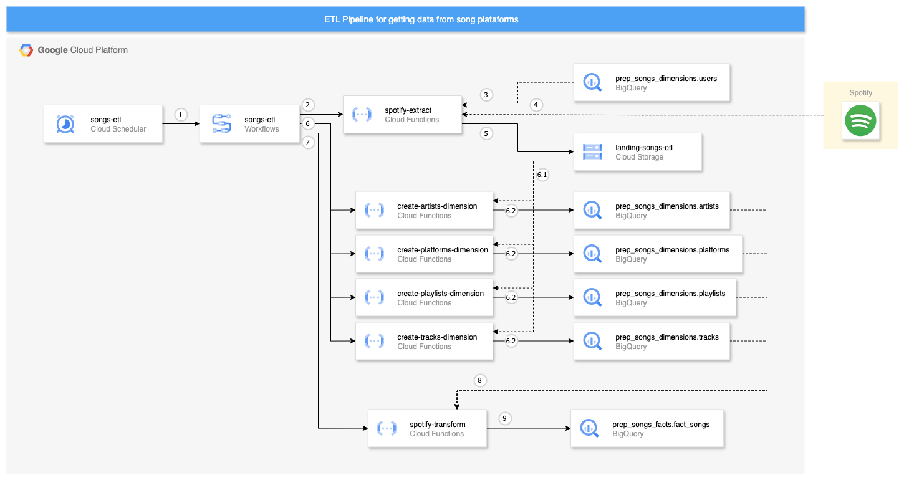

# ETL de Músicas

Este projeto foi desenvolvido para praticar conceitos de engenharia de dados, criando um pipeline ETL que centraliza informações de músicas, playlists e usuários em um modelo dimensional (star schema).

Atualmente, o ETL integra dados apenas do Spotify, mas o desenho da solução foi planejado para suportar múltiplas plataformas de streaming no futuro

## Diagrama da solução



## Passos para Configuração

### 1. Obter a Service Account (SA)
Coloque o arquivo de credenciais da SA na raiz do projeto com o nome:

```
terraform-sa.json
```

---

### 2. Exportar as credenciais
```bash
export GOOGLE_APPLICATION_CREDENTIALS=/path/to/your/terraform-sa.json
```

---

### 3. Criar o arquivo de variáveis
No diretório `terraform/`, crie o arquivo:

```
terraform.tfvars
```
Preencha com as variáveis definidas em `variables.tf`.

---

## Caso a infraestrutura **não exista ainda**

### 1. Fazer login no gcloud com a SA
```bash
gcloud auth activate-service-account --key-file=terraform-sa.json
```

### 2. Definir o projeto (substitua `PROJECT_ID`)
```bash
gcloud config set project PROJECT_ID
```

### 3. Criar o bucket para armazenar o estado do Terraform
> **Se o bucket já existir**, utilize outro nome e atualize o arquivo `terraform/main.tf`.

```bash
gcloud storage buckets create gs://terraform-state-project-songs   --location=us-central1   --project=SEU_PROJECT_ID   --uniform-bucket-level-access
```

Ativar versionamento no bucket:
```bash
gcloud storage buckets update gs://terraform-state-project-songs   --versioning
```

### 4. Inicializar e aplicar o Terraform
No diretório `terraform`:

```bash
terraform init
terraform plan
terraform apply
```

---

## Executar uma Cloud Function (após configuração)

### 1. Acessar a pasta da Cloud Function
```bash
cd path/to/cloud-function
```

### 2. Exportar credenciais
```bash
export GOOGLE_APPLICATION_CREDENTIALS=/path/to/your/terraform-sa.json
```

### 3. Criar arquivo `.env` com variáveis necessárias

### 4. Criar ambiente virtual (venv)
```bash
python -m venv venv
```

### 5. Ativar o ambiente virtual
- Linux/Mac:
  ```bash
  source venv/bin/activate
  ```
- Windows:
  ```bash
  venv\Scripts\activate
  ```

### 6. Instalar dependências
```bash
pip install -r requirements.txt
```

### 7. Iniciar servidor da Cloud Function
```bash
functions-framework --target=main --debug
```
